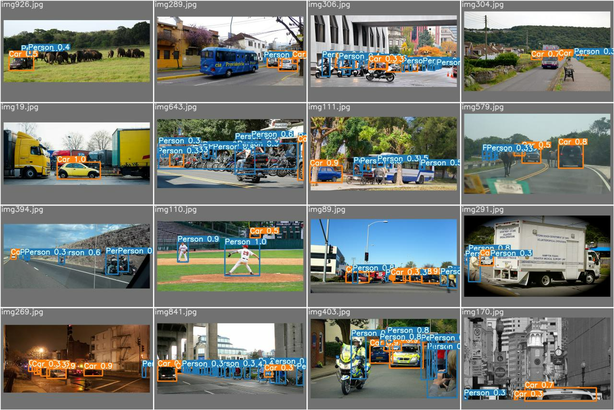
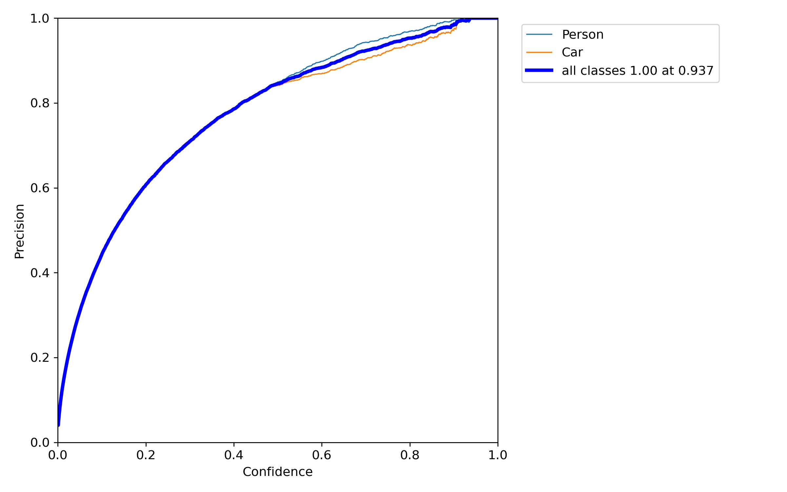
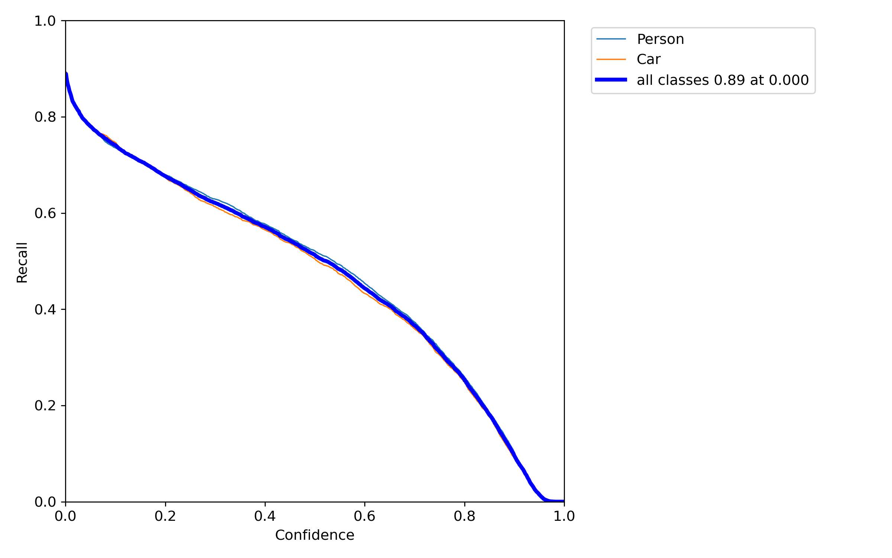
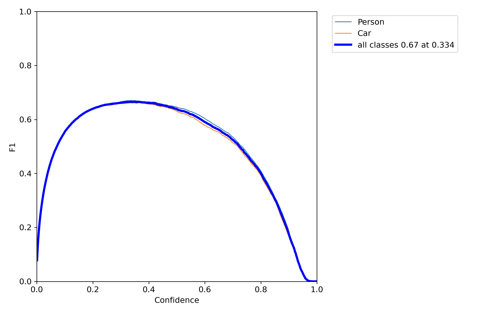
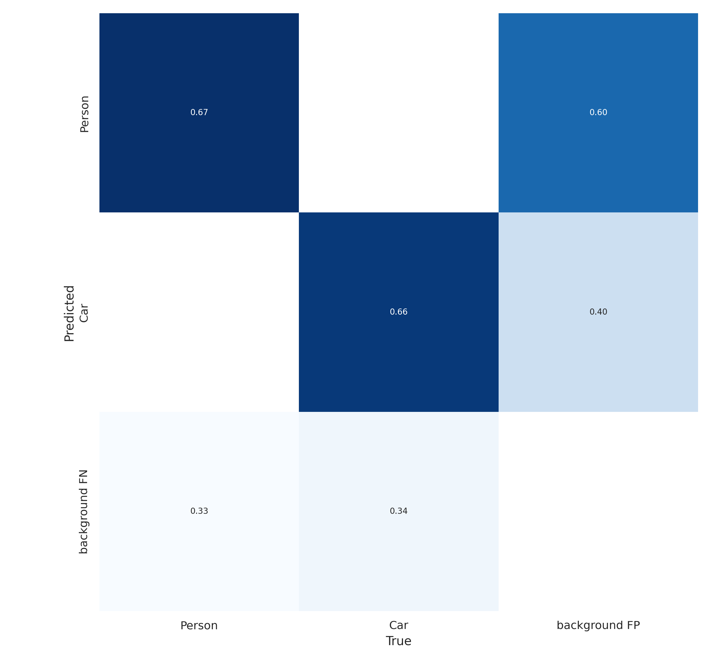

# object-detection-custom-yolov7-tiny

Training YOLOv7-tiny on custom dataset

### Problem Definition

Training YOLOv7-pretrained model on custom dataset for Person and Car Object.

### Steps

- I created the Person and Car dataset from COCO and changed the data format to YOLOv7.
- How I created dataset? Please [click to see the jupyter notebook](https://github.com/iqbalfarz/object-detection-custom-yolov7-tiny/blob/main/jupyter_notebooks/creating_custom_dataset_for_detection.ipynb)
- Then, I created(uploaded) the dataset to Kaggle using Kaggle API and then
- Trained YOLOv7-tiny model for `60` epochs on custom dataset and did the inferencing on test images.

### Metrics

#### precision

#### Recall

#### F1-Curve

#### Confusion Matrix

### Report

- See the report here: [Click to see the report of training YOLOv7-tiny on custom dataset containing Person and Car](https://wandb.ai/mdiqbalbajmi/car-person-object-detection/reports/Transfer-Learning-of-YOLOv7-tiny-on-custom-dataset--VmlldzozMDI0ODMz?accessToken=akmt56bbwgu1kushqp3ik3udmte313eotszssmptcusq42yilrh3ks2g8oic1m9y)
